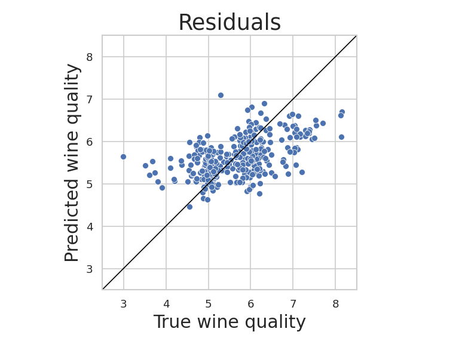

# MLOps_CI : How to create an automatic model training & testing setup using GitHub Actions and Continuous Machine Learning(CML)

## Feature Importance

## Residuals

## Metrics
Training variance explained: 33.0%
Test variance explained: 32.0%
